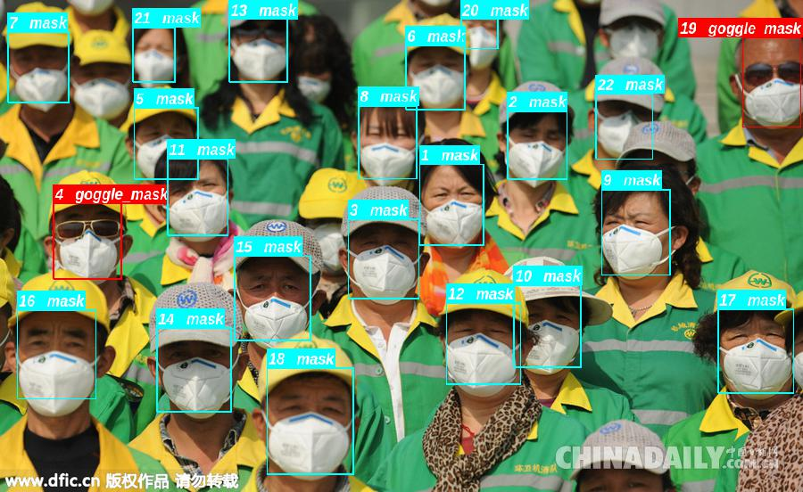

# RetinaFace

## Environment
- Caffe
- TensorRT-6.0.1.5
- Cuda 9.0

## Demo
```
$ mkdir build
$ cd build/
$ cmake ../
$ make
$ ./retinaface img_path
```
you need to modify dependency path in CmakeList file.

## Speed

test hardware：1080Ti



## Note

当第一次运行的时候，可能会出现模型转换错误的问题，不过没有问题，再次运行即可。
